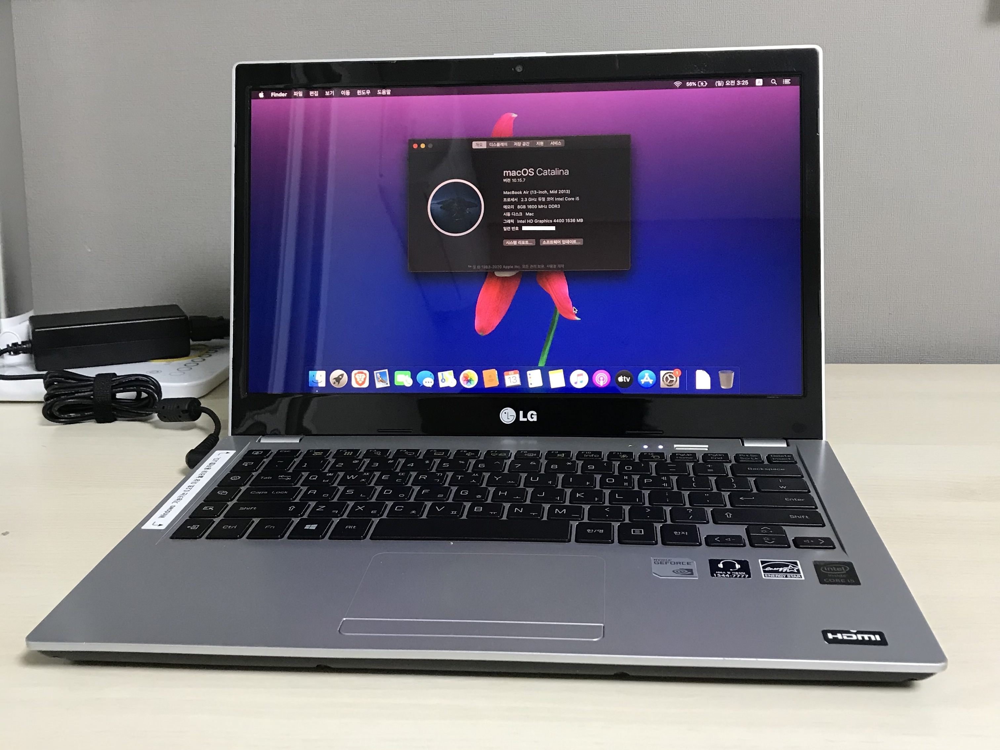

# LG 14U530 Hackintosh
It tested with macOS Catalina, and Big Sur.

## Before You Install...
- You should type `ControlMsrE2.efi unlock` by using OpenShell.efi.
- __Or__ enable `AppleXcpmCfgLock` in config.plist.

## System Spec
| Components | Details |
| - | - |
| CPU | Intel Core i5-4200U |
| iGPU | Intel HD Graphics 4400 |
| dGPU | NVIDIA GeForce GT 720M |
| RAM | 2x HMT451S6BFR8A-PB |
| LCD | LP140WF1-SPJ1 (LGD0406) |
| WLAN | AC 7260 |
| Audio | Realtek ALC282 |
| BIOS | 14U530F9 (04/17/2014) |

## BIOS Setup Configs
- Legacy OS Boot: Off
- PXE Boot: Off
- xHCI Mode: Enabled
- Secure Boot Option: Off

## Reported Issues
- ❌ DGPU and hibernation doesn't work.
- ⚠️ VGA output works, but it can't detect unplugging.
- Sometimes, a "dummy" external monitor (connected via VGA) is detected after wake up.
- (Itlwm) Wi-Fi doesn't work after wake up.
- (Itlwm) Bluetooth is unstable when Wi-Fi is enabled.
- (RealtekCardReader) Card reader doesn't work after wake up. kernel panic occurred when card is inserted.
- kernel panic occurred by IntelBluetoothFirmware. (rarely)
